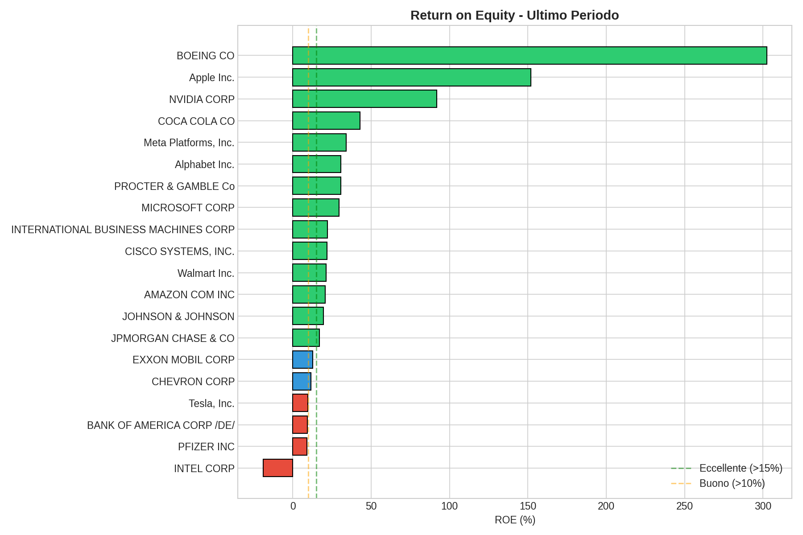
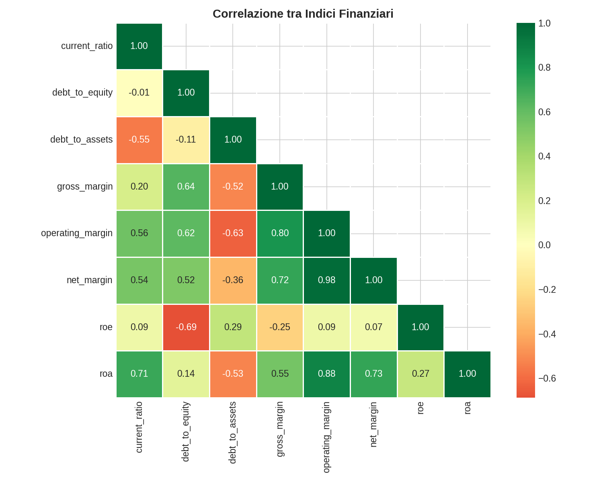
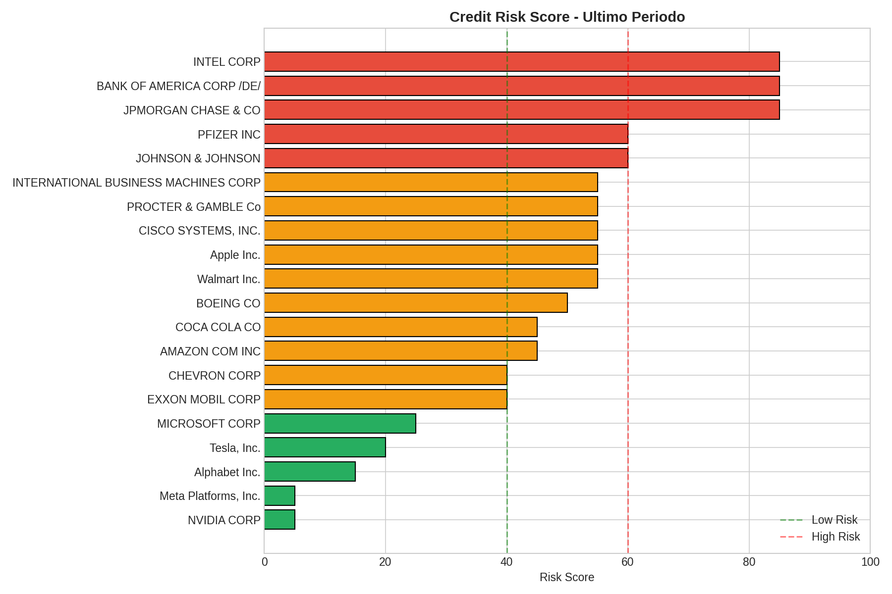

# Credit Risk Lakehouse

Pipeline per l'analisi del rischio creditizio basata su dati finanziari pubblici SEC EDGAR.

## Features

- Download automatico filing 10-K da SEC EDGAR
- Parsing XBRL con estrazione dati finanziari normalizzati
- Calcolo indici: current ratio, D/E, ROE, ROA, margini operativi
- Storage locale in DuckDB (zero infrastruttura)
- Pronto per scaling su Databricks/Spark

## Quick Start
```bash
# Setup
git clone https://github.com/youruser/credit-risk-lakehouse.git
cd credit-risk-lakehouse
python -m venv .venv
source .venv/bin/activate
pip install -e ".[dev]"

# Download filing (singola azienda)
python scripts/download.py --cik 0000320193  # Apple

# Download top 20 US companies
python scripts/download.py --all

# Parse e calcola ratios
python scripts/parse.py --all

# Query dati
python -c "
import duckdb
conn = duckdb.connect('data/credit_risk.duckdb')
print(conn.execute('''
    SELECT c.name, r.period_end, 
           ROUND(r.roe * 100, 1) as roe_pct,
           ROUND(r.debt_to_equity, 2) as d_e
    FROM ratios r
    JOIN companies c ON r.cik = c.cik
    WHERE r.period_end >= '2024-01-01'
    ORDER BY r.roe DESC
''').fetchdf())
"
```

## Struttura
```
credit-risk-lakehouse/
├── src/credit_risk/
│   ├── sec_client.py     # API SEC EDGAR
│   ├── xbrl_parser.py    # Parser XBRL
│   ├── ratios.py         # Calcolo indici
│   └── db.py             # DuckDB operations
├── scripts/
│   ├── downloads.py      # CLI download
│   └── parse.py          # CLI parsing
├── notebooks/
│   └── 01_exploratory_analysis.ipynb  # Analisi esplorativa
├── data/
│   ├── raw/xbrl/         # Filing XBRL grezzi
│   └── credit_risk.duckdb
└── tests/
```

## Analisi Esplorativa

Il notebook `notebooks/01_exploratory_analysis.ipynb` contiene un'analisi completa del dataset con:

- **Overview**: 20+ aziende US, ~60 periodi finanziari
- **Distribuzione indici**: istogrammi di tutti i ratio finanziari
- **Ranking ROE**: classifica aziende per Return on Equity
- **Correlazioni**: matrice correlazione tra indici
- **Leverage vs Profittabilità**: scatter plot D/E vs ROE
- **Trend temporali**: evoluzione medie nel tempo
- **Anomalie**: identificazione outlier (bassa liquidità, alto leverage)
- **Risk Score**: profilo rischio sintetico 0-100

### Esempi di Output

#### ROE Ranking per Azienda


#### Matrice di Correlazione tra Indici


#### Credit Risk Score


## Indici calcolati

| Indice | Formula | Uso |
|--------|---------|-----|
| Current Ratio | Current Assets / Current Liabilities | Liquidità |
| Debt to Equity | Total Liabilities / Shareholders Equity | Leverage |
| Debt to Assets | Total Liabilities / Total Assets | Leverage |
| Gross Margin | Gross Profit / Revenue | Profittabilità |
| Operating Margin | Operating Income / Revenue | Profittabilità |
| Net Margin | Net Income / Revenue | Profittabilità |
| ROE | Net Income / Shareholders Equity | Rendimento |
| ROA | Net Income / Total Assets | Efficienza |
| OCF to Debt | Operating Cash Flow / Total Liabilities | Solvibilità |

## Roadmap

- [ ] Altman Z-Score
- [ ] Piotroski F-Score  
- [ ] Time-series features (CAGR, volatilità)
- [ ] ML model per default prediction
- [ ] Export Databricks Solution Accelerator

## License

MIT